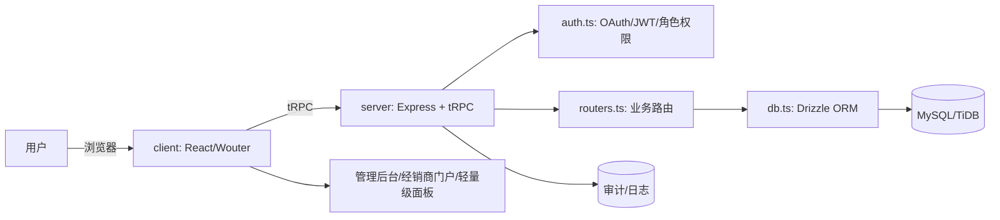

# Rebate System 技术设计文档

## 1. 背景与目标

本系统用于**经销商返利与对账管理**,支持多层级返利计算、结算周期管理、对账单生成,并包含三大核心模块:

- **管理后台** - 经销商/产品/订单/结算/政策管理
- **轻量级后台管理面板** - 用户管理增强/CMS/系统设置
- **经销商门户** - 对账单查看/采购计算器/历史记录

## 2. 技术栈概览

### 前端
- **React 19** + **TypeScript** - 类型安全的用户界面
- **Tailwind CSS 4** + **shadcn/ui** - 现代化UI组件库
- **tRPC** - 端到端类型安全API调用
- **Wouter** - 轻量级路由

### 后端
- **Node.js 22** + **Express 4** - 服务端运行环境
- **tRPC 11** - 类型安全的API层
- **Drizzle ORM** - 现代化数据库ORM
- **MySQL/TiDB** - 关系型数据库

## 3. 目录结构与职责边界

```
rebate_system/
├── client/                    # 前端应用
│   ├── src/pages/            # 页面组件(后台/门户/面板)
│   ├── src/components/       # 可复用UI组件
│   ├── src/lib/             # 工具函数/请求/状态管理
│   └── src/App.tsx          # 应用入口/路由配置
├── server/                   # 后端服务
│   ├── routers.ts           # tRPC路由聚合
│   ├── db.ts                # 数据库访问/查询封装
│   ├── auth.ts              # 认证/鉴权逻辑
│   └── _core/               # 核心框架(中间件/上下文/错误处理)
├── drizzle/schema.ts        # 数据表定义
├── shared/                   # 前后端共享类型/常量
└── scripts/                  # 部署脚本
```

## 4. 总体架构



## 5. 核心业务流

### 5.1 订单 → 结算周期 → 结算单

1. **订单录入** - 支持多产品订单,记录经销商采购明细
2. **结算周期创建** - 定义结算时间范围,激活/停用控制
3. **结算计算** - 自动计算:
   - 核心返利(阶梯式)
   - 市场基金(按比例)
   - 下级提成
   - 综合让利
4. **审批结算单** - 财务审核确认
5. **生成对账单** - 经销商可查看/导出

### 5.2 采购计算器(门户侧)

1. 输入目标回款/产品组合
2. 计算最优采购方案
3. 保存历史记录
4. 支持回溯对比

## 6. 关键模块设计

### 6.1 client(前端)

#### pages/
- **Admin** - 经销商/产品/订单/结算/政策配置等管理能力
- **Dealer Portal** - 对账单、采购计算器、历史记录、密码管理
- **Light Admin Panel** - 用户管理增强、CMS、系统设置

#### components/
- 业务组件(表格、表单、审批流、富文本)
- 通用组件(分页、搜索、弹窗、通知)

#### lib/
- tRPC client、鉴权token管理、错误处理、工具函数

### 6.2 server(后端)

#### _core/
- **tRPC context** - 注入用户信息/角色/请求追踪
- **middleware** - 鉴权、RBAC、输入校验、错误标准化

#### auth.ts
- OAuth登录(系统所有者自动成为管理员)
- 经销商账号由管理员创建;首次登录强制改密
- 登录历史记录(面板侧可追踪)

#### routers.ts
- **dealerRouter** - 经销商CRUD、层级关系、状态管理
- **productRouter** - 产品信息、价格维护
- **orderRouter** - 订单录入/编辑/删除,多产品订单
- **settlementRouter** - 周期管理、返利计算、审批、对账单生成
- **policyRouter** - 返利阶梯、市场基金比例等参数
- **adminPanelRouter** - 用户/角色、CMS、系统设置、安全策略、备份任务

#### db.ts
- Drizzle连接与查询封装
- 事务边界:结算计算/审批必须事务化
- 审计写入:关键写操作落审计表

### 6.3 drizzle/schema.ts(数据模型分组)

- **身份与权限** - users, roles, user_roles, login_history
- **主数据** - dealers, products, price_rules
- **交易** - orders, order_items, payments
- **结算** - settlement_cycles, settlements, settlement_items
- **政策** - rebate_tiers, market_fund_rules
- **内容** - announcements, help_docs, notifications
- **系统** - system_settings, security_policies, backup_jobs, audit_logs

## 7. 安全与合规

### 7.1 RBAC(基于角色的访问控制)
- 管理员/运营/财务/经销商等角色隔离
- 细粒度权限控制(数据权限+操作权限)

### 7.2 审计日志
- 订单、政策、结算审批必须记录操作者与前后值
- 关键操作可追溯、可回溯

### 7.3 密钥管理
- JWT_SECRET、数据库连接串、SMTP等全部走环境变量
- 生产环境密钥定期轮换

### 7.4 数据备份
- 自动备份任务配置
- 定期恢复演练

## 8. 部署与运维

### 8.1 环境要求
- Node.js 22+ + pnpm 9+
- MySQL 8.0+ 或 TiDB
- Nginx(反向代理)
- PM2(进程守护)

### 8.2 GitHub Actions CI/CD
- **CI** - install / lint / typecheck / test / build
- **CD** - push main触发,SSH到腾讯云执行`scripts/deploy_remote.sh`

### 8.3 部署流程
1. 代码推送到main分支
2. GitHub Actions自动触发CI检查
3. CI通过后触发CD部署
4. SSH连接到腾讯云服务器
5. 拉取最新代码
6. 安装依赖、构建、推送数据库schema
7. PM2滚动重启应用

## 9. 观测性与故障定位

### 9.1 请求追踪
- request_id注入context,贯穿API/DB/日志
- 便于定位问题请求链路

### 9.2 关键指标
- 结算计算耗时
- 订单写入失败率
- 登录失败率
- 接口95/99延迟

### 9.3 告警机制
- 进程退出告警
- CPU/内存使用率告警
- 数据库连接池耗尽告警
- 错误率突增告警

## 10. 性能优化

### 10.1 数据库优化
- 合理索引设计(经销商ID、订单日期、结算周期)
- 查询优化(避免N+1查询)
- 连接池配置

### 10.2 缓存策略
- 政策参数缓存(Redis)
- 经销商信息缓存
- 结算计算结果缓存

### 10.3 前端优化
- 代码分割(按路由)
- 图片懒加载
- API请求合并

## 11. 扩展性设计

### 11.1 水平扩展
- 无状态API设计
- Session存储外置(Redis)
- 负载均衡支持

### 11.2 功能扩展
- 插件化政策计算引擎
- 可配置的审批流
- 多租户支持预留

## 12. 技术债务与改进方向

- [ ] 添加单元测试覆盖率(目标80%+)
- [ ] 集成端到端测试(Playwright)
- [ ] 完善API文档(OpenAPI/Swagger)
- [ ] 添加性能监控(APM)
- [ ] 实现操作日志审计功能
- [ ] 富文本编辑器集成
- [ ] 数据导出功能增强
